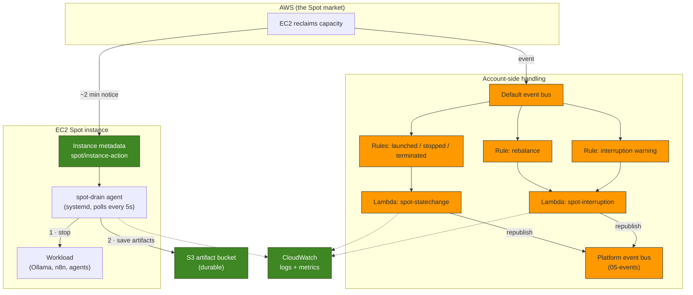
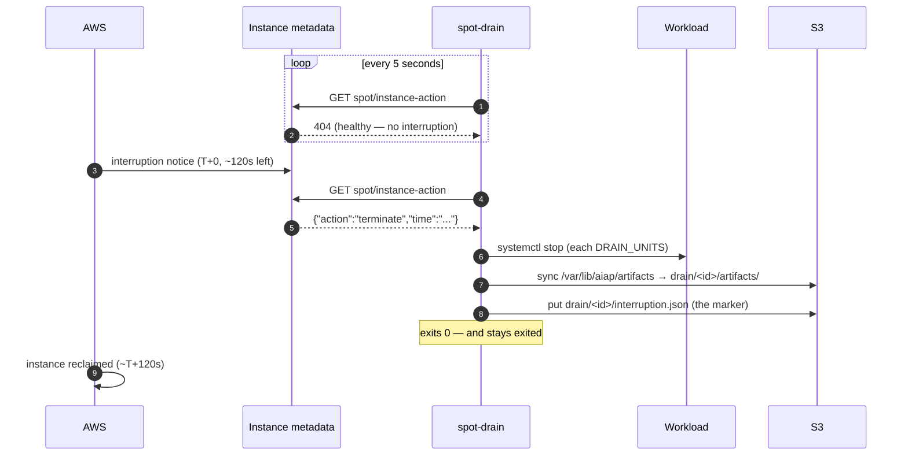

# EC2 Spot Instances

Run the platform's compute at roughly **70% off On-Demand**, and survive the
interruptions that discount pays for.

- **Buy** — a Spot instance, in the compute stack ([`03-compute.yaml`](cloudformation/03-compute.yaml))
- **Watch** — a drain agent on the instance, and EventBridge rules in the account
- **Drain** — save the work before AWS takes the instance away
- **Record** — count every interruption, so the trade-off is a number, not a hunch

Provisioned by [`08-spot.yaml`](cloudformation/08-spot.yaml) (the account-side
handlers) and [`03-compute.yaml`](cloudformation/03-compute.yaml) (the on-host
drain agent). The Go code is in [`lambda/`](lambda).

The *why* is in the blog post,
[Reducing AI Infrastructure Costs with EC2 Spot Instances](../docs/blog/reducing-ai-infrastructure-costs-with-ec2-spot-instances.md).
This file is the operational reference.

## Contents

- [The one thing to understand first](#the-one-thing-to-understand-first)
- [Architecture](#architecture)
- [The events](#the-events)
- [The drain agent](#the-drain-agent)
- [Deployment](#deployment)
- [Parameters](#parameters)
- [IAM](#iam)
- [Logging](#logging)
- [Metrics](#metrics)
- [Testing an interruption](#testing-an-interruption)
- [Cost](#cost)
- [When not to use Spot](#when-not-to-use-spot)
- [AI workloads on Spot](#ai-workloads-on-spot)
- [Cleanup](#cleanup)
- [Troubleshooting](#troubleshooting)

## The one thing to understand first

> **A Lambda cannot save your work.**

When AWS reclaims a Spot instance it gives about **two minutes** of notice. It is
tempting to think the interruption Lambda is what "handles" that. It is not. By
the time EventBridge has delivered the event and Lambda has cold-started, a
meaningful fraction of the window is gone — and even with all 120 seconds, a
function in the account cannot reach into the instance and flush a half-written
file to disk.

So interruption handling is **two cooperating halves**, and neither is sufficient
alone:

| | Runs | Sees the notice via | Job |
| --- | --- | --- | --- |
| **Drain agent** | on the instance | instance metadata (IMDS) | Stop the workload. Save its output to S3. |
| **Lambda handlers** | in the account | EventBridge | Count it. Log it. Tell the rest of the platform. |

The drain agent is what makes Spot *safe*. The Lambdas are what make it
*observable*. This milestone builds both.

## Architecture



Two paths leave the reclaim decision. The **left** path is the one that saves
your work, and it never leaves the instance. The **right** path is the one that
tells the platform, and it never touches the instance.

### Why the rules are on the *default* bus

AWS services publish their events to the account's **default** event bus. There
is no way to make EC2 publish to a custom one. A rule on the platform's own bus
matching `source: aws.ec2` is valid YAML, deploys cleanly, and **never fires** —
a mistake that looks exactly like working code.

So the rules in `08-spot.yaml` sit on the default bus, and the handlers
*re-publish* onto the platform bus. That crossing is deliberate: it is the seam
later milestones subscribe to, without ever knowing these events began life as
EC2 service events.

### Why the handlers filter by tag

EC2's events carry an instance ID and **no tags**. A rule cannot say "only my
instances" — so these rules match *every* instance in the region, including ones
this platform has never heard of.

The handlers therefore call `DescribeInstances`, read the `Project` and
`Environment` tags, and ignore anything that is not theirs. An event for a
foreign instance is a **successful no-op**, never an error — a handler that
failed on other people's instances would page you for someone else's deploy.

This is why `03-compute.yaml` tags the instance with `Project` and `Environment`.
Those two tags are not decoration: **an instance without them is invisible to its
own interruption handling.**

## The events

Five rules, all on the default bus, all documented here.

| # | Rule | Detail-type | Fires when | Handler | Metric |
| --- | --- | --- | --- | --- | --- |
| 1 | `…-spot-interruption-warning` | `EC2 Spot Instance Interruption Warning` | AWS will reclaim the instance in ~2 minutes | `spot-interruption` | `InterruptionWarnings` |
| 2 | `…-spot-rebalance` | `EC2 Instance Rebalance Recommendation` | The instance is at *elevated risk* of interruption (advisory; nothing reclaimed yet) | `spot-interruption` | `RebalanceRecommendations` |
| 3 | `…-instance-launched` | `EC2 Instance State-change Notification` (`running`) | An instance finished booting | `spot-statechange` | `InstancesLaunched` |
| 4 | `…-instance-stopped` | `EC2 Instance State-change Notification` (`stopped`) | An instance stopped (the scheduler, or a `stop`-behaviour Spot interruption) | `spot-statechange` | `InstancesStopped` |
| 5 | `…-instance-terminated` | `EC2 Instance State-change Notification` (`terminated`) | An instance was destroyed — for a one-time Spot instance, the last thing that ever happens to it | `spot-statechange` | `InstancesTerminated` |

**The warning and the rebalance recommendation are different signals.** The
rebalance recommendation can arrive *well before* the interruption notice, and
sometimes without one ever following. It is advice ("move if you can"), not a
deadline. The interruption warning is the deadline. Rule 2 can be turned off with
`RebalanceRuleState=DISABLED` if the extra events are noise in a single-instance
environment.

The transitional states (`pending`, `stopping`, `shutting-down`) have no rule and
no metric: every one of them is followed by a terminal state that does.

### What a warning looks like

EventBridge delivers this:

```json
{
  "version": "0",
  "detail-type": "EC2 Spot Instance Interruption Warning",
  "source": "aws.ec2",
  "time": "2026-07-13T12:00:00Z",
  "resources": ["arn:aws:ec2:us-east-1:123456789012:instance/i-0abc123"],
  "detail": {
    "instance-id": "i-0abc123",
    "instance-action": "terminate"
  }
}
```

`instance-action` is `terminate`, `stop`, or `hibernate` — it is the
`SpotInterruptionBehavior` the instance was launched with, coming back to you.

### What the platform re-publishes

The same event, resolved and flattened, on the platform bus — so a subscriber
does not have to call EC2 to find out what was interrupted:

```json
{
  "source": "aiap.dev.platform",
  "detail-type": "Spot Interruption Warning",
  "detail": {
    "kind": "spot-interruption",
    "instanceId": "i-0abc123",
    "instanceType": "t3.xlarge",
    "lifecycle": "spot",
    "action": "terminate",
    "noticeTime": "2026-07-13T12:00:00Z",
    "drainDeadline": "2026-07-13T12:02:00Z",
    "project": "aiap",
    "environment": "dev"
  }
}
```

`source` matches the pattern the platform bus's rule filters on (`05-events`), so
the existing dispatch function receives it today — which is how you can prove the
whole chain end to end before anything is subscribed to it.

## The drain agent

Installed by the compute stack's user data as a systemd unit, `spot-drain.service`.



In order, and the order matters:

1. **Stop the workload**, so nothing is still writing while the upload runs.
   Which units, is the `DrainUnits` parameter (empty until a later milestone
   installs one).
2. **Save the artifacts.** Everything in `/var/lib/<project>/artifacts` is synced
   to `s3://<artifact-bucket>/drain/<instance-id>/artifacts/`. This is the entire
   point: **the instance is disposable, its output is not.**
3. **Leave a marker** — `interruption.json`, holding the notice. Without it, a
   post-mortem cannot tell an instance that drained cleanly from one that simply
   vanished.

Then it exits 0 and **stays exited** (`Restart=on-failure`, deliberately not
`always`): a restarted agent would find the same notice still present and drain a
second time, uploading over the work it just saved.

**Where a workload must write.** `/var/lib/<project>/artifacts` is the contract.
Anything a later milestone wants to survive an interruption goes there, and
anything written anywhere else on the root volume is gone when the instance is
reclaimed — the volume is `DeleteOnTermination: true`.

**IMDSv2 only.** The agent fetches a session token before every read, because the
launch template sets `HttpTokens: required`. The metadata path 404s for the whole
healthy life of an instance, so the "error" branch of the poll is the normal case
and a response body is the exception that matters.

## Deployment

Spot interruption handling is an **add-on**, kept out of the core `make deploy`
because it needs the Go toolchain and the artifact bucket. Prerequisites: the
[core stacks](README.md) deployed, Go, and `zip`.

```bash
cd infra

# Build the handlers, upload them, and deploy the stack:
make spot

# ...which is just these two, if you want them separately:
make package        # build all four Go Lambdas (arm64) and upload the zips
make deploy-spot    # deploy 08-spot
```

The compute stack already buys Spot by default (`PurchaseOption=spot`), so
nothing else is needed to *get* a Spot instance. If the compute stack is already
deployed, redeploy it to pick up the drain agent and the ownership tags:

```bash
make deploy-03-compute
```

> **That replaces the instance.** The drain agent lives in the launch template's
> user data, so adding it is a new template version, and the instance tracks the
> latest version. This is intended — the instance is disposable. If replacing it
> loses something, that something was in the wrong place.

In CI, all of this happens automatically when infra changes land on `main`: the
workflow deploys the core stacks, then packages and deploys the Spot stack.

## Parameters

### `08-spot.yaml`

| Parameter | Default | Notes |
| --- | --- | --- |
| `ProjectName` | `aiap` | Prefix for names. Match the other stacks. |
| `Environment` | `dev` | Match the other stacks. |
| `LambdaCodeBucket` | *(required)* | S3 bucket with the zips; set by `make package`. |
| `InterruptionCodeKey` | `spot/interruption.zip` | S3 key of the interruption handler. |
| `StateChangeCodeKey` | `spot/statechange.zip` | S3 key of the state-change handler. |
| `LogRetentionDays` | `14` | Lambda log retention. |
| `LambdaTimeoutSeconds` | `30` | Three fast API calls, plus headroom for retries under throttling. |
| `RebalanceRuleState` | `ENABLED` | `DISABLED` to ignore the advisory rebalance signal. |

### `03-compute.yaml` (the Spot-relevant ones)

| Parameter | Default | Notes |
| --- | --- | --- |
| `PurchaseOption` | `spot` | `spot` or `on-demand`. On-demand if the account's Spot quota is zero. |
| `SpotInterruptionBehavior` | `terminate` | `terminate` (one-time request, disposable) or `stop` (persistent request, stoppable — required by the scheduler). |
| `SpotMaxPrice` | *(empty)* | Empty caps at the On-Demand price, which is the right answer. See below. |
| `InstanceType` | `t3.xlarge` | The interruption rate is a property of the *type*, in an AZ. |
| `LatestAmiId` | *(SSM)* | Latest AL2023; override to pin an AMI. |
| `SshKeyName` | *(empty)* | Empty = no key, SSM Session Manager only. Recommended. |
| `SubnetId` / `SecurityGroupId` | *(empty)* | Empty = import from the network stack. Override to use an existing VPC. |
| `RootVolumeSize` | `30` | GiB. Deleted on termination — hence the drain agent. |
| `DrainUnits` | *(empty)* | Space-separated systemd units to stop on interruption, e.g. `"ollama.service n8n.service"`. |
| `DrainPollSeconds` | `5` | How often to poll IMDS. AWS recommends 5. |

> **`SpotMaxPrice` does not make Spot cheaper.** You always pay the current market
> price, not your bid. A cap below the On-Demand price does not lower the bill; it
> only means your instance is interrupted sooner and launches less often. Leave it
> empty (capped at On-Demand) unless you want it as a hard spend guard rail.

## IAM

`08-spot.yaml` creates one role for both handlers. Every statement is scoped, and
the two that *cannot* be scoped by resource are scoped some other way:

| Grant | Scope | Why |
| --- | --- | --- |
| `ec2:DescribeInstances` | `*` | The action does not support resource-level permissions. It is read-only, and it is the **only** EC2 permission these functions hold: they can look, and they cannot touch. Nothing here can stop, start, or terminate an instance. |
| `events:PutEvents` | the platform bus ARN | They can publish the platform's events and no others — they cannot put events on the default bus and impersonate an AWS service. |
| `cloudwatch:PutMetricData` | `*`, **conditioned** on `cloudwatch:namespace` | `PutMetricData` takes no resource ARN at all. The condition key is the only way to scope it — and it is a real scope: this role writes into `<project>/spot` and nowhere else. |
| `logs:CreateLogStream`, `logs:PutLogEvents` | the two log groups | The stack declares the log groups, so their names are known, not guessed. |

Each of the five rules gets its **own** `AWS::Lambda::Permission`, scoped to that
rule's ARN — so an unrelated rule created elsewhere in the account cannot drive
these handlers.

The **instance** needs nothing new: the drain agent writes to the artifact bucket
using the instance role from `02-iam.yaml`, which already allows exactly that
bucket and nothing else.

## Logging

Both handlers emit structured JSON, one object per line, to
`/aws/lambda/<project>-<env>-spot-interruption` and `…-spot-statechange`.

An interruption, handled end to end:

```json
{"time":"2026-07-13T12:00:01Z","level":"WARN","msg":"spot interruption warning received","kind":"spot-interruption","instanceId":"i-0abc123","detailType":"EC2 Spot Instance Interruption Warning","eventTime":"2026-07-13T12:00:00Z","action":"terminate","drainDeadline":"2026-07-13T12:02:00Z","drainWindow":"2m0s"}
{"time":"2026-07-13T12:00:01Z","level":"INFO","msg":"metric published","kind":"spot-interruption","instanceId":"i-0abc123","instanceType":"t3.xlarge","lifecycle":"spot","metric":"InterruptionWarnings","namespace":"aiap/spot"}
{"time":"2026-07-13T12:00:01Z","level":"INFO","msg":"platform event emitted","kind":"spot-interruption","instanceId":"i-0abc123","bus":"aiap-dev-bus","source":"aiap.dev.platform"}
{"time":"2026-07-13T12:00:01Z","level":"INFO","msg":"spot-interruption handled","notified":true,"metric":"InterruptionWarnings"}
```

An event about somebody else's instance — the common case, and a success:

```json
{"time":"2026-07-13T12:04:10Z","level":"INFO","msg":"event received","kind":"state-change","instanceId":"i-0deadbeef","state":"running"}
{"time":"2026-07-13T12:04:10Z","level":"INFO","msg":"instance is not tagged for this platform; ignoring","instanceType":"m5.large","lifecycle":"on-demand","project":"aiap","environment":"dev"}
```

A misrouted rule — an error, loudly, because the right function never saw the event:

```json
{"time":"2026-07-13T12:00:01Z","level":"ERROR","msg":"misrouted event","kind":"spot-interruption","error":"event kind not handled by this function: spot-interruption","accepts":["state-change"]}
```

The drain agent logs on the instance, to `/var/log/<project>-spot-drain.log`:

```text
2026-07-13T12:00:00Z spot-drain: drain agent started; polling every 5 seconds
2026-07-13T12:00:02Z spot-drain: interruption notice: {"action":"terminate","time":"2026-07-13T12:02:00Z"}
2026-07-13T12:00:02Z spot-drain: stopping ollama.service
2026-07-13T12:00:03Z spot-drain: saving artifacts to s3://aiap-dev-artifacts-…/drain/i-0abc123/
2026-07-13T12:00:11Z spot-drain: artifacts saved
2026-07-13T12:00:11Z spot-drain: drain complete
```

Read it while the instance is still alive (`journalctl -u spot-drain`), or read
the S3 marker afterwards — the instance will not be there to ask.

## Metrics

Namespace **`<project>/spot`**, dimensioned by `Environment` and `InstanceType`.

| Metric | Meaning |
| --- | --- |
| `InterruptionWarnings` | AWS reclaimed an instance. |
| `RebalanceRecommendations` | AWS warned an instance was at risk. |
| `InstancesLaunched` / `InstancesStopped` / `InstancesTerminated` | Lifecycle counts. |

Dimensioning by `InstanceType` is the point of the exercise: **"how often is this
interrupted?" is a question about a type in an AZ**, and it is the number that
decides whether a workload belongs on Spot at all. Two weeks of
`InterruptionWarnings` on `t3.xlarge` turns "Spot feels risky" into "Spot
interrupted us four times last month, and each cost us nine minutes."

```bash
aws cloudwatch get-metric-statistics \
  --namespace aiap/spot --metric-name InterruptionWarnings \
  --dimensions Name=Environment,Value=dev Name=InstanceType,Value=t3.xlarge \
  --start-time "$(date -u -d '30 days ago' +%Y-%m-%dT%H:%M:%SZ)" \
  --end-time "$(date -u +%Y-%m-%dT%H:%M:%SZ)" \
  --period 86400 --statistics Sum --region us-east-1
```

The metric uses the *event's* timestamp, not the invocation's, so a retried
invocation cannot smear one interruption across two minutes of the graph.

## Testing an interruption

You cannot make AWS interrupt an instance on demand, and you cannot fake the
event either: AWS reserves the `aws.` source prefix, so `PutEvents` will refuse
to publish an `aws.ec2` event. Three honest options, in increasing fidelity:

**1. Invoke the handler with the real payload** — tests the handler, its IAM
policy, the metric, and the platform event. Everything except EventBridge's
delivery:

```bash
make simulate-interruption INSTANCE_ID=i-0abc123
```

**2. Fake the notice on the instance** — tests the *drain agent*, which is the
half that matters. The agent reads IMDS, so point it somewhere you control: run
it by hand with `IMDS` overridden at the top of `/usr/local/bin/spot-drain`
against a local stub, and watch it stop the units and sync to S3.

**3. AWS Fault Injection Service (FIS)** — the only way to trigger a *real*
interruption, with a real IMDS notice and a real EventBridge event. It is
deliberately **not** in this stack: this milestone's service list is EC2,
EventBridge, Lambda, IAM, CloudFormation, and CloudWatch, and FIS would be a
seventh. Run it ad hoc when you want the real thing:

```bash
aws fis create-experiment-template --cli-input-json '{
  "description": "Interrupt the platform Spot instance",
  "actions": {"interrupt": {
    "actionId": "aws:ec2:send-spot-instance-interruptions",
    "parameters": {"durationBeforeInterruption": "PT2M"},
    "targets": {"SpotInstances": "instance"}}},
  "targets": {"instance": {
    "resourceType": "aws:ec2:spot-instance",
    "resourceArns": ["arn:aws:ec2:us-east-1:123456789012:instance/i-0abc123"],
    "selectionMode": "ALL"}},
  "stopConditions": [{"source": "none"}],
  "roleArn": "arn:aws:iam::123456789012:role/<fis-role>"
}'
```

## Cost

Why Spot is cheaper, in one sentence: **you are renting capacity AWS has already
built and cannot sell, on the condition that it can have it back.** The discount
is the price of that condition. It is the same hardware, the same network, the
same AMI — the only difference is who gets to keep it under contention.

Steady-state, `us-east-1`, the default `t3.xlarge`:

| Purchase | ~$/hour | 24×7 | Interruptible? | Stoppable? |
| --- | --- | --- | --- | --- |
| On-Demand | ~$0.166 | ~$120/mo | no | yes |
| **Spot (the default)** | **~$0.05** | **~$36/mo** | yes | only with `stop` behaviour |
| Spot + [scheduler](SCHEDULER.md) (14h/day) | ~$0.05 | ~$21/mo | yes | requires `stop` behaviour |

**~$84/month saved** on one small instance, for a workload that can tolerate being
restarted. The saving scales with the instance, which is where AI workloads make
it interesting:

| Instance | On-Demand 24×7 | Spot 24×7 | Saved |
| --- | --- | --- | --- |
| `t3.xlarge` (the default) | ~$120/mo | ~$36/mo | ~$84/mo |
| `g5.xlarge` (GPU inference) | ~$730/mo | ~$220/mo | **~$510/mo** |
| `g5.12xlarge` (larger models) | ~$4,100/mo | ~$1,250/mo | **~$2,850/mo** |

A GPU is where the discount stops being a rounding error and starts deciding
whether a project is affordable at all. *(Prices are illustrative, vary by region
and AZ, and Spot prices move — treat them as an order of magnitude, not a quote.)*

**The cost of an interruption** is not zero, and pretending otherwise is how
people get burned. It is: the work in flight (redone), plus the cold start of the
replacement (minutes, and the reason Milestone 4 bakes an AMI). If a job takes 20
minutes and the interruption rate is once a week, that is a trivially good trade.
If a job takes 30 hours and cannot checkpoint, it is a terrible one.

### One-time vs persistent requests

| | One-time (`terminate`) — the default | Persistent (`stop`) |
| --- | --- | --- |
| On interruption | instance is **terminated**, gone | instance is **stopped**, disk preserved |
| Comes back? | no — nothing retries | yes — AWS restarts it when capacity returns |
| Can be stopped/started? | **no** | yes — required by the [scheduler](SCHEDULER.md) |
| Fits | disposable, replaceable compute | a box you want to keep |

The default is one-time and disposable, which is what makes the drain agent
load-bearing: nothing is coming back, so anything not saved is lost.

## When not to use Spot

Honestly, and this is the part most write-ups skip:

- **Anything with state you cannot rebuild.** A database, a queue's only broker, a
  workflow engine's only node. If losing it loses data, it does not go on Spot.
- **Long, uncheckpointed jobs.** A 30-hour fine-tune with no checkpointing will
  be interrupted, and you will start again. Checkpoint, or pay On-Demand.
- **Latency-critical, user-facing serving with no fallback.** An interrupted
  inference endpoint with nothing behind it is an outage. Spot is fine *behind* a
  managed backstop (Bedrock, an On-Demand node) — that is exactly the hybrid
  routing Milestone 10 builds.
- **Anything that cannot be drained in two minutes.** If shutting down cleanly
  takes ten minutes, the window is not long enough and the drain is a fiction.
- **Capacity you must have *right now*.** Spot can be unavailable. A one-time
  request that cannot be filled simply does not launch.

The rule of thumb: **Spot is for compute you could lose and merely be annoyed.**

## AI workloads on Spot

Which of this platform's workloads belong on Spot, and why:

| Workload | Spot? | Why |
| --- | --- | --- |
| **Batch inference** (score a backlog) | ✅ ideal | Restartable per item. Interrupt it, resume, nobody notices. |
| **Embeddings generation** | ✅ ideal | Embarrassingly parallel and idempotent — recompute a chunk and get the same vector. |
| **Repository indexing / analysis** | ✅ ideal | Re-reading a repo is cheap; the output is a file in S3. |
| **Technical blog generation** | ✅ good | Minutes long, drafts to S3, and nobody is waiting on a keystroke. |
| **Background workers / scheduled jobs** | ✅ good | Late is acceptable; that is what "background" means. |
| **Ollama — batch/offline inference** | ✅ good | Model reload on restart is the whole cost, and Milestone 4's baked AMI shrinks it. |
| **Ollama — interactive serving** | ⚠️ only with a fallback | An interruption mid-conversation is a user-visible failure unless a managed model catches it. |
| **n8n (the orchestrator)** | ❌ no | It holds workflow state. It is the thing that *reschedules* interrupted work; it cannot be the thing that gets interrupted. |
| **The control plane** | ❌ no | Serverless already, and it must survive the compute it manages. |

The pattern: **the plane that does the work goes on Spot; the plane that
remembers the work does not.** That split is the whole architecture, and it is
why this platform separates them in the first place.

To use it, a workload needs to do exactly two things:

1. Write anything worth keeping to `/var/lib/<project>/artifacts`.
2. Be listed in `DrainUnits`, so the agent stops it before saving.

## Cleanup

```bash
make delete-spot      # the handlers, rules, role, and log groups
```

The compute stack keeps its drain agent (it is part of the launch template); to
remove that, redeploy compute from a template without it, or delete the stack.
The platform bus and the artifact bucket belong to other stacks and are untouched.
Anything already drained to `s3://…/drain/` **stays** — that is the point of it,
and it is not this stack's to delete.

Full teardown is `make delete` (the artifact bucket is retained by design).

## Troubleshooting

| Symptom | Cause / fix |
| --- | --- |
| `There is no Spot capacity available that matches your request` | **Capacity**, not price and not quota — see [below](#no-spot-capacity). |
| `Max spot instance count exceeded` on deploy | The account's Spot quota is zero — common on new accounts. Request a Spot quota increase (it is measured in vCPUs; a `t3.xlarge` needs 4), or deploy `PURCHASE=on-demand` in the meantime. See the [infra README](README.md#troubleshooting). |
| The handler runs but always says *"not tagged for this platform"* | The instance is missing the `Project`/`Environment` tags. It predates Milestone 3 — redeploy `03-compute` (which replaces it), or add the tags by hand. |
| The handler never runs at all | The rules are on the **default** bus. If they were moved to the platform bus, they will never fire — EC2 cannot publish there. Check `aws events list-rules --name-prefix <project>-<env>`. |
| *"instance no longer exists"* in the logs | The instance was described after EC2 had already forgotten it. Rare, and harmless: ownership cannot be determined, so nothing is counted. |
| Nothing in S3 after an interruption | The workload did not write to `/var/lib/<project>/artifacts`, or it was not in `DrainUnits` and was still writing during the sync. Check `/var/log/<project>-spot-drain.log` — but read it *before* the instance is reclaimed, or find the marker in S3 afterwards. |
| The drain agent is not running | `systemctl status spot-drain`. It runs on every instance, including On-Demand ones (where the IMDS path simply 404s forever — harmless). |
| A misrouted-event error in the logs | A rule points at the wrong function. That is a deployment bug, and it is loud on purpose: the correct function is not seeing the event. |
| The instance restarts itself after a manual stop | Expected for a **persistent** Spot request (`SpotInterruptionBehavior=stop`) — that *is* the interruption-recovery behaviour. See [SCHEDULER.md](SCHEDULER.md). |
| Interruptions are constant | The instance type is scarce in that AZ. The interruption rate is a property of the type — check the `InterruptionWarnings` metric per `InstanceType`, and pick a less contended type. Flexibility across types and AZs is the real fix, and it needs an Auto Scaling group (Milestone 16). |

### No Spot capacity

```text
There is no Spot capacity available that matches your request.
```

This is the one that catches people, because it is **not** a price problem and
**not** a quota problem (`Max spot instance count exceeded` is the quota one).
There is simply no spare capacity of that instance type, in that AZ, at that
moment. A one-time Spot request that cannot be filled does not launch, and the
stack rolls back.

Lowering `SpotMaxPrice` does not help. Raising it does not help either — you were
never outbid. **Capacity is not for sale.**

This platform runs one instance, in one subnet, in one AZ, of one type. That is
**zero capacity flexibility, by construction**, and no amount of interruption
handling fixes it — interruption handling protects your *work*, not your ability
to launch.

Ask AWS where the capacity actually is, rather than guessing (10 is best, 1 worst):

```bash
aws ec2 get-spot-placement-scores --region us-east-1 \
  --instance-types t3.xlarge c5.xlarge m5.xlarge \
  --target-capacity 1 --target-capacity-unit-type units \
  --region-names us-east-1 --single-availability-zone
```

Three ways out, in increasing order of how much they actually fix:

1. **Pick a type with capacity in your AZ.** `make deploy-03-compute
   INSTANCE_TYPE=c5.xlarge` (or the `AWS_INSTANCE_TYPE` repository variable in
   CI). Cheapest change; still a single point of failure.
2. **Fall back to On-Demand.** `PURCHASE=on-demand`. Always has capacity, costs
   ~3× more. The drain agent and all five rules still deploy and work — the IMDS
   notice path simply never fires.
3. **Diversify.** Several instance types across several AZs, with the
   `capacity-optimized` allocation strategy, behind an **Auto Scaling group**.
   This is the only real answer, and it is Milestone 16. The compute stack
   already provisions through a launch template precisely so that this is a
   change of container, not a rewrite.

Retrying sometimes works, because capacity fluctuates. It is a coin toss, not a
fix.
